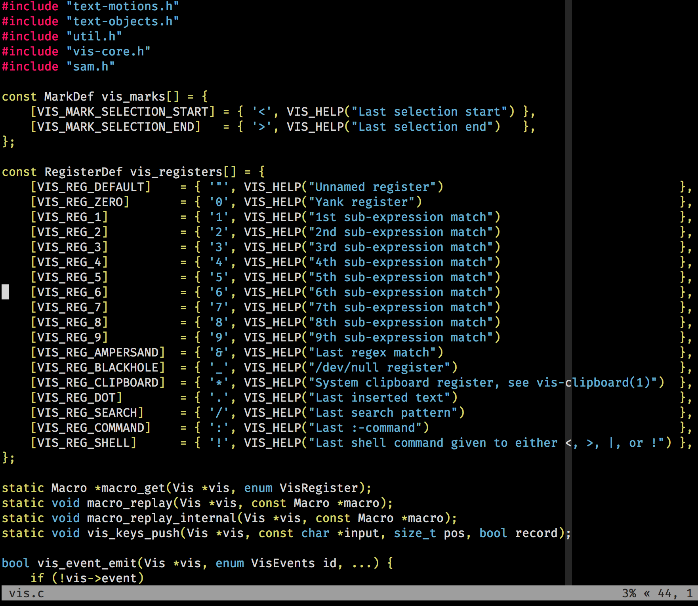

# vis-seti

A seti theme for the [vis editor](https://github.com/martanne/vis). 

The theme file is in `seti.lua` in addition you can require the `init.lua` as
a [plugin](https://github.com/martanne/vis/wiki/Plugins), which calls `set_theme` on `INIT`.

